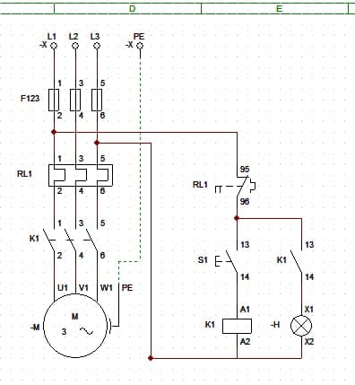
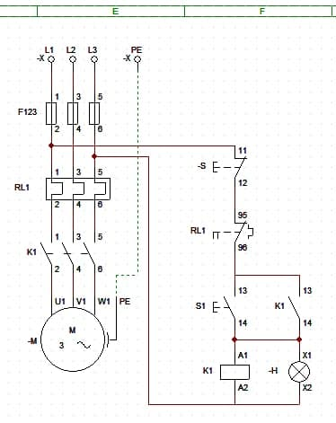

# IMD - ACIONAMENTOS ELETRONICOS

**Módulo Avançado Eletrônica**

Neste repositório será demonstrado diferentes formas de acionamentos de motores exploradas durantes as aulas do curso técnico.

## Acionamentos

Os diagramas foram desenvolvidos para o acionamento direto de um motor trifasico. Para isso, utilizamos o software [CADe SIMU](https://www.cadesimu.net). Os [arquivos](./Arquivos) possuem a extensão **.cad**, que por sua vez, é compatível com o software.

### Partida Direta:

O acionamento de partida direta contém:

-   **Circuito de força:** ligado a fonte de alimentação trifásica e ao motor. Contém dispositivos para proteção do motor - fusíveis e o relé de sobrecarga - e os contatores. _Se traçar-mos uma linha vertical imaginária que secciona o diagrama ao meio, podemos identificar este circuito no lado esquerdo do diagrama._

-   **Circuito de controle:** ligado as duas fases da alimentação trifásica. Contém um relé de sobrecarga para proteção, uma chave pulsante e uma bobina que servem para acionamento do circuito de força. _Usando novamente a linha imaginária, identificamos este circuito no lado direito do diagrama._

`Enquanto chave pulsante S1 permanecer pressionada, o motor estará funcionando. Ela energiza o circuito de controle e faz com que a bobina crie um campo magnético que feche o circuito de força pela atração dos contatores.`

---

### Partida Direta com Sinalização:

O diagrama muda bem pouco em comparação ao diagrama da Partida Direta, com diferença somente no acréssimo de uma simples sinalização que acenderá enquanto o motor estiver ligado.

`Quando a chave S1 é acionada, a bobina vai fechar tanto os contactores como também a chave que aciona da lâmpada -H, isso fará com que haja sinalização quando o motor estiver ligado.`

---

### Partida Direta com Selo

A partida direta com selo acrescenta uma ligação chaveada do circuito de sinalização com o de controle que faz a alimentação da bobina bastando apenas uma ativação única da chave **S1**.

Pelo fato de ser necessário ativar a chave uma única vez, é posto agora uma outra chave **-S** responsável pela parada forçada do motor.
